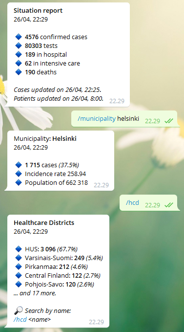

# COVID-19 Finland: Discord & Telegram bot

***REMOVED***
***REMOVED***

This chatbot allows you to track various COVID-19 statistics in Finland, such as the total number of confirmed cases, tests and deaths. Currently supported platforms are [Telegram](https://telegram.org/) and [Discord](https://discordapp.com/) which can be run separately or in parallel depending on which API tokens are provided to the program. The bot operates both in English and Finnish depending on the per-channel preference. For now, the choice of language is the only state persisted by the program.

Here are the available commands since v2.0.0: 

| Command      | Explanation                    |
|--------------|--------------------------------|
| situation    | Show a situation update        |
| age          | Total cases by age group       |
| sex          | Total cases by sex             |
| hcd          | Stats for healthcare districts |
| municipality | Stats for municipalities       |
| usage        | Show command list              |
| about        | Show about                     |
| lang         | Change language                |

Screenshot:



## Running
To run this project yourself, you need a Telegram or a Discord API token.

Telegram: https://core.telegram.org/bots  
Discord: https://discordapp.com/developers/docs/intro
```bash
# Import your API tokens
echo "TELEGRAM_API_TOKEN=secret" > .env
echo "DISCORD_API_TOKEN=secret" > .env 
npm start
```

## Changelog
This version of the bot (v2) is a complete rewrite, so you should not keep any files when migrating from [v1](v1). 

```
v2.0.0 (Major)
================================================================
+ Changed data API to direct upstream by THL
+ Added patients and tests to the situation report
+ Added a command for listing and filtering municipalities
+ Added a command for listing and filtering healthcare districts
+ Added a command for showing cases by different demographics
+ Added localization support and two languages
- Removed most emojis as unnecessary
- Removed notifications for now (WIP)
- Removed daily changes for now (WIP)
- Switched from Typescript to Javascript
```

---
_The bot uses data from the [public coronavirus API](https://thl.fi/fi/tilastot-ja-data/aineistot-ja-palvelut/avoin-data/varmistetut-koronatapaukset-suomessa-covid-19-) by [THL.fi](https://thl.fi/).
The service is for indicative purposes only and provided
"as-is", "with all faults" and "as available". There are no guarantees
for the accuracy or timeliness of information available from the service._